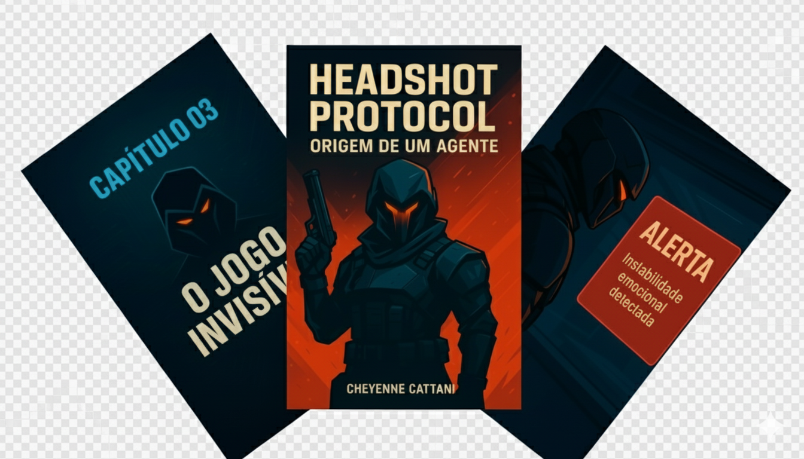

<p align="center">
    
</p>

<p align="center">
<a href="https://dio.me/"></a>
<a href="https://angular.io/" title="Go to Angular homepage"></a></p>

-------

<p align="center">
    
</p>

# 📚 EBOOKS GERADOS COM IA + DIREÇÃO HUMANA

Este repositório reúne projetos criados com apoio de **IA (ChatGPT)** para construção de conteúdo **visual e narrativo**, porém **com direção, curadoria e decisões criativas humanas**.  
A IA **não atuou de forma autônoma** — cada passo foi orientado, revisado e aprovado manualmente.

---

## 🎯 Projeto 01 — *Angularverse: O Código Jedi do Front-End*

**Descrição:**  
Ebook técnico que apresenta conceitos de Angular (componentização, modularidade, arquitetura e boas práticas) em uma narrativa inspirada na estética e jornada Jedi.

**Objetivo:**  
Mostrar como a IA pode acelerar o processo criativo sem substituir o raciocínio humano no desenvolvimento técnico.

**📕 Ler o eBook:**  

➡️ <a href="https://github.com/ccattani/ebook-gerado-por-ia/blob/main/output/ebook-angularverse-o-codigo-jedi-do-front-end.pdf" title="View PDF now"> 📕Ebook Angularverse</a>

**💻 Ferramentas Utilizadas**
| Ferramenta | Função |
|-----------|--------|
| ChatGPT | Criação do conteúdo textual e estrutura dos capítulos |
| PowerPoint | Diagramação visual e layout final |
| Angular | Base temática do conteúdo |

**🧠 Exemplos de Prompts Utilizados**
| Finalidade | Prompt |
|-----------|--------|
| Título | "Crie um título épico sobre Angular inspirado na temática Jedi." |
| Capítulos | "Explique modularização e componentização como uma jornada de aprendizado." |
| Imagens | "Descreva o estilo visual do universo Angular como um cenário sci-fi." |
| Encerramento | "Crie um texto de agradecimento reforçando parceria humano + IA." |

---

## 🔥 Projeto 02 — *HEADSHOT PROTOCOL: Origem de um Agente*

**Descrição:**  
Ebook narrativo inspirado na estética de Valorant, acompanhando a história de **Protocol**, um agente moldado por trauma, precisão e auto-descoberta.

**Observação Importante:**  
Este é um conteúdo **não oficial**, criado **apenas para fins narrativos e de entretenimento**.

**📕 Ler o eBook:**  
➡️ <a href="https://github.com/ccattani/ebook-gerado-por-ia/blob/main/output/ebook-headshot-protocal.pdf" title="View PDF now"> 📕Ebook HEADSHOT PROTOCOL - Origem de um Agente</a>

**🎨 Estética**
- Paleta em tons de **azul profundo + laranja radianita**
- Visual inspirado na atmosfera do jogo
- Ritmo narrativo direto, seco e intenso

**💻 Ferramentas Utilizadas**
| Ferramenta | Função |
|-----------|--------|
| ChatGPT | Roteiro, cenas, diálogos e estrutura narrativa |
| PowerPoint | Diagramação final e ajustes de layout |

---


1. Clone o repositório:
   ```bash
   git clone https://github.com/ccattani/ebook-gerado-por-ia.git
