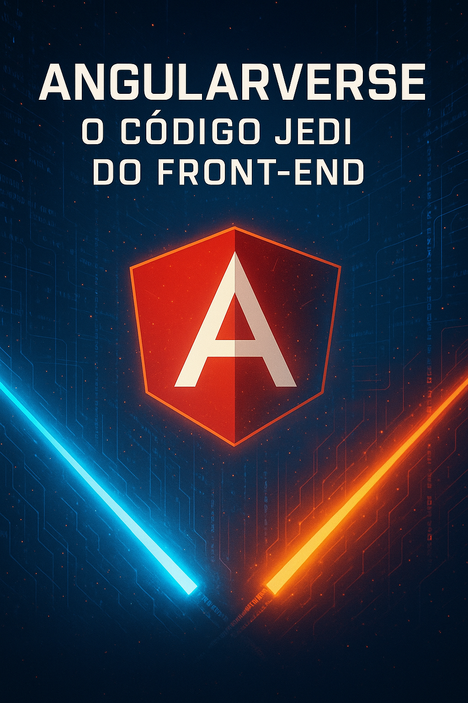
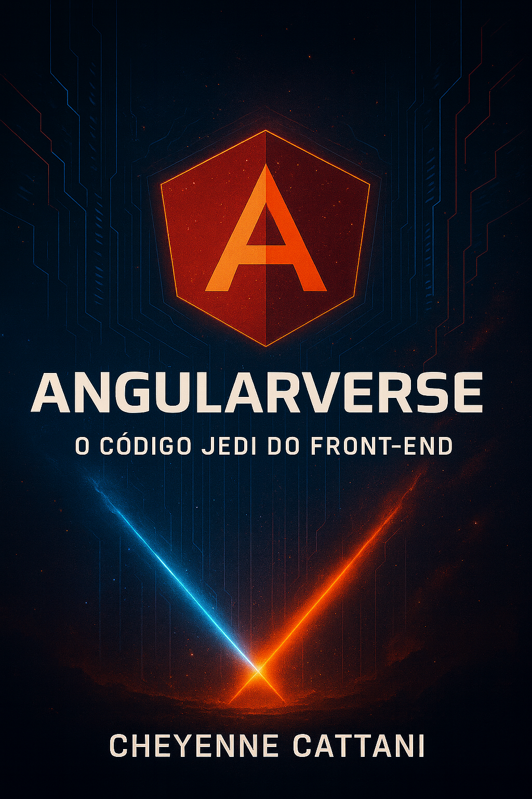

<p align="center">
    
</p>

<p align="center">
<a href="https://dio.me/"></a>
<a href="https://angular.io/" title="Go to Angular homepage"></a></p>

-------

<p align="center">
    
</p>

# Projeto EBOOK: **Angularverse – O Código Jedi do Front-End**

> ℹ️ **NOTE:** Este é um projeto experimental desenvolvido com o uso de Inteligência Artificial, explorando como IA pode ser utilizada na criação de conteúdo técnico e visual.

O objetivo foi criar um eBook completo — texto, estrutura e design — **totalmente gerado por IA**, integrando ferramentas modernas para demonstrar como o processo criativo e técnico pode ser potencializado com automação inteligente.  
O conteúdo do eBook aborda conceitos de **Angular**, **componentização**, **modularidade** e **boas práticas de arquitetura front-end** em um formato didático e visualmente imersivo.

📕 **Acesse o eBook completo:**  
[👉 Clique aqui para ler](https://github.com/ccattani/ebook-gerado-por-ia)

---

## 💻 Tecnologias utilizadas no projeto

- [ChatGPT](https://chat.openai.com/) — geração de conteúdo textual, estrutura conceitual e as imagens
- [PowerPoint](https://www.microsoft.com/en/microsoft-365/powerpoint) — montagem visual e diagramação final  
- [Angular](https://angular.io/) — inspiração e temática técnica  

---

## 🧠 Prompts utilizados

| Ação | Prompt |
| :--: | :------ |
| **Título** | Crie um título para um eBook técnico sobre Angular, com uma temática inspirada em Star Wars. Ele deve soar épico e futurista, como “Angularverse: O Código Jedi do Front-End”. |
| **Capítulos** | Crie 2 capítulos sobre princípios avançados de desenvolvimento com Angular, abordando temas como modularização, componentização e escalabilidade. O tom deve ser narrativo e técnico, como se fosse uma jornada Jedi. |
| **Imagens** | Gere capas e páginas ilustradas com visual de galáxia, estilo sci-fi, tons escuros com detalhes em laranja e vermelho, e o logo do Angular no topo direito. |
| **Agradecimentos** | Crie um texto de encerramento agradecendo e destacando o uso de IA como parceira na criação de conteúdo técnico e criativo. |

---

## ✨ Features

- Texto e narrativa gerados via **ChatGPT**
- Imagens criadas via **DALL·E**
- Estrutura e layout inspirados em **documentação técnica real**
- Visual temático — **galáxia Angular / universo Jedi**

---

## 📚 Materiais

- Imagens finais em `assets/`
- eBook gerado em `output/`

---

## 🛠️ Instruções de execução

1. Clone o repositório:
   ```bash
   git clone https://github.com/ccattani/ebook-gerado-por-ia.git
